<p align="center">
  
</p>

<p align="center">
  <strong>Decentralized Sports Betting on Movement Network</strong>
</p>

<p align="center">
  <a href="https://sports-move.vercel.app/">Live App</a> •
  <a href="#features">Features</a> •
  <a href="#architecture">Architecture</a> •
  <a href="#getting-started">Getting Started</a> •
  <a href="#smart-contracts">Smart Contracts</a>
</p>

<p align="center">
  
  
  
  
  
</p>

---

## Introduction

**Sports Move** is a fully decentralized sports betting platform built on the [Movement Network](https://movementnetwork.xyz/) blockchain. It enables users to place bets on major American sports leagues using smart contracts written in the Move programming language.

### Why Sports Move?

- **Decentralized** — All bets, payouts, and market resolutions happen on-chain
- **Transparent** — Open-source contracts with verifiable odds and outcomes
- **Fast** — Sub-second finality on Movement Network
- **Fair** — House-backed system with automatic settlements and refunds

### Supported Sports

| League | Sport Key |
|--------|-----------|
| 🏈 NFL | `americanfootball_nfl` |
| 🏀 NBA | `basketball_nba` |
| 🏒 NHL | `icehockey_nhl` |
| ⚾ MLB | `baseball_mlb` |

---

## Features

### Core Betting Features

- **American Odds Format** — Familiar +/- odds display (e.g., +150, -200)
- **Real-Time Odds** — Live odds from FanDuel via [The Odds API](https://the-odds-api.com/)
- **Head-to-Head Markets** — Moneyline bets on game winners
- **Automatic Settlement** — Bets are settled automatically when games complete
- **Full Refunds** — Cancelled/tied games trigger automatic refunds

### Blockchain Features

- **smUSD Stablecoin** — Custom betting token with 8 decimal precision
- **Testnet Faucet** — Get up to 1,000 smUSD per request for testing
- **House-Backed Payouts** — Escrow system ensures winnings are always covered
- **5% House Fee** — Applied only to profits, not the original stake
- **Multi-Admin Oracle** — 4 admin wallets for redundancy and security

### User Experience

- **Nightly Wallet Integration** — Seamless wallet connection
- **Live Countdown Timers** — See when games start
- **Bet Confirmation Confetti** — Celebratory animations on successful bets
- **User Statistics Dashboard** — Track your betting performance with charts
- **Responsive Design** — Works on desktop and mobile

---

## Architecture

Sports Move follows a three-tier architecture with a Fly.io background service for continuous data synchronization.

### System Diagram

```mermaid
%%{init: {'theme': 'dark', 'themeVariables': { 'primaryColor': '#1a1a2e', 'primaryTextColor': '#fff', 'primaryBorderColor': '#f5b400', 'lineColor': '#f5b400', 'secondaryColor': '#0d0d1a', 'tertiaryColor': '#2d2d2d'}}}%%
flowchart TB
    subgraph USER["👤 User"]
        Browser["Browser"]
    end

    subgraph EXTERNAL["🌐 External Services"]
        OddsAPI["The Odds API<br/>(Live Odds & Scores)"]
        Faucet["Movement Faucet<br/>(MOVE Tokens)"]
    end

    subgraph FLYIO["🚀 Fly.io Background Service"]
        JobService["sports-move-job<br/>⏱️ Every 30 sec<br/>🌙 Quiet: 1AM-8AM"]
    end

    subgraph GHA["⚙️ GitHub Actions (Backup)"]
        FundJob["fund-admin-wallet<br/>⏱️ Every 1 hour"]
    end

    subgraph FRONTEND["🖥️ Frontend (Next.js 16)"]
        UI["React App<br/>Markets | Bets | Faucet"]
        Wallet["Nightly Wallet<br/>Extension"]
    end

    subgraph API["🔌 API Layer (Next.js Routes)"]
        GetMarkets["/api/get-markets"]
        GetBets["/api/get-user-bets"]
        MintAPI["/api/mint-smusd"]
        MarketsAPI["/api/markets"]
        ScoresAPI["/api/scores"]
    end

    subgraph BLOCKCHAIN["⛓️ Movement Network Testnet"]
        subgraph CONTRACTS["Smart Contracts"]
            SMUSD["smusd.move<br/>• mint()<br/>• register()<br/>• transfer()"]
            Betting["sports_betting.move<br/>• create_market()<br/>• place_bet()<br/>• resolve_market()<br/>• settle_bets()"]
        end
        Vault["Resource Account<br/>(House Vault)"]
    end

    %% User flows
    Browser --> UI
    UI <--> Wallet
    Wallet -->|"Sign Tx"| Betting
    UI --> GetMarkets
    UI --> GetBets
    UI --> MintAPI

    %% API to Blockchain
    GetMarkets -->|"view"| Betting
    GetBets -->|"view"| Betting
    MintAPI -->|"mint"| SMUSD
    MarketsAPI -->|"create/update"| Betting
    ScoresAPI -->|"resolve & settle"| Betting

    %% Fly.io and GitHub Actions flows
    JobService --> MarketsAPI
    JobService --> ScoresAPI
    FundJob --> Faucet
    MarketsAPI --> OddsAPI
    ScoresAPI --> OddsAPI

    %% Contract relationships
    Betting <--> SMUSD
    Betting <--> Vault

    %% Styling - Dark theme with white text
    classDef external fill:#4a1942,stroke:#fff,stroke-width:1px,color:#fff
    classDef gha fill:#1a4d2e,stroke:#fff,stroke-width:1px,color:#fff
    classDef frontend fill:#1a3a5c,stroke:#fff,stroke-width:1px,color:#fff
    classDef api fill:#5c4a1a,stroke:#f5b400,stroke-width:2px,color:#fff
    classDef blockchain fill:#0d0d1a,stroke:#f5b400,stroke-width:2px,color:#fff
    classDef user fill:#2d2d2d,stroke:#fff,stroke-width:1px,color:#fff

    class OddsAPI,Faucet external
    class JobService flyio
    class FundJob gha
    class UI,Wallet frontend
    classDef flyio fill:#4a1a5c,stroke:#fff,stroke-width:1px,color:#fff
    class GetMarkets,GetBets,MintAPI,MarketsAPI,ScoresAPI api
    class SMUSD,Betting,Vault blockchain
    class Browser user
```



### Component Overview

| Layer | Technology | Purpose |
|-------|------------|---------|
| **Frontend** | Next.js 16, React 19, Tailwind v4 | User interface, wallet connection |
| **API** | Next.js API Routes | Backend logic, contract interactions |
| **Contracts** | Move Language | On-chain betting logic, token management |
| **Background Jobs** | Fly.io | Market sync, score updates (every 30s) |
| **Automation** | GitHub Actions | Admin wallet funding (backup for jobs) |

### Data Flows

| Flow | Path | Trigger |
|------|------|---------|
| **View Markets** | User → Frontend → API → Contract | User action |
| **Place Bet** | User → Wallet → Contract | User signs tx |
| **Get smUSD** | User → Frontend → API → Contract | User action |
| **Sync Odds** | Fly.io → API → The Odds API → Contract | Every 30 sec |
| **Settle Bets** | Fly.io → API → The Odds API → Contract | Every 30 sec |
| **Fund Admin** | GH Actions → Faucet → Admin Wallet | Every 1 hour |

---

## Smart Contracts

### Contract Address

```
0xc90dabb5730415a099ff16d8edf5a3a350ff28d3183e2ecb80182312cc99d5cb
```

### smUSD Stablecoin (`smusd.move`)

A fungible token implementation for betting transactions.

| Function | Description |
|----------|-------------|
| `initialize()` | Deploy the stablecoin (called once) |
| `register(account)` | Register account to receive smUSD |
| `mint(to, amount)` | Mint smUSD to any address |
| `transfer(from, to, amount)` | Transfer tokens between accounts |
| `burn(account, amount)` | Burn tokens from account |
| `balance_of(addr)` | View balance (returns u64) |
| `total_supply()` | View total supply (returns u128) |

**Token Details:**
- Name: Sports Move USD
- Symbol: smUSD
- Decimals: 8

### Sports Betting Contract (`sports_betting.move`)

The core betting logic with markets, bets, and settlements.

#### Data Structures

```move
struct Market {
    game_id: String,
    sport_key: String,
    sport_title: String,
    home_team: String,
    away_team: String,
    commence_time: u64,
    home_odds: u64,
    home_odds_positive: bool,
    away_odds: u64,
    away_odds_positive: bool,
    odds_last_update: u64,
    is_resolved: bool,
    is_cancelled: bool,
    winning_outcome: String,
}

struct Bet {
    bet_id: u64,
    user: address,
    game_id: String,
    outcome: String,
    amount: u64,
    odds: u64,
    odds_positive: bool,
    potential_payout: u64,
    is_settled: bool,
    timestamp: u64,
}
```

#### Admin Functions

| Function | Description |
|----------|-------------|
| `initialize(admin1, admin2, admin3, admin4)` | Initialize with 4 admin addresses |
| `create_market(...)` | Create new betting market |
| `update_market_odds(...)` | Update odds for existing market |
| `resolve_market(game_id, winning_team)` | Declare winner |
| `cancel_market(game_id)` | Cancel and refund all bets |
| `settle_bets(game_id)` | Pay out winning bets |
| `deposit_house_funds(amount)` | Add funds to house balance |
| `add_admin(new_admin)` | Add new admin (owner only) |
| `remove_admin(admin)` | Remove admin (owner only) |

#### User Functions

| Function | Description |
|----------|-------------|
| `place_bet(game_id, outcome, amount)` | Place a bet on a market |

#### View Functions

| Function | Description |
|----------|-------------|
| `get_markets()` | Get all markets |
| `get_market(game_id)` | Get specific market |
| `get_user_bets(user)` | Get all bets for a user |
| `get_bet(bet_id)` | Get specific bet |
| `get_house_balance()` | Get house balance |
| `get_admins()` | Get admin addresses |
| `calculate_payout_view(amount, odds, is_positive)` | Calculate potential payout |

#### Odds Calculation

**Positive Odds (Underdog):**
```
payout = stake + (stake × odds / 100)
Example: $100 at +320 = $420 payout ($320 profit)
```

**Negative Odds (Favorite):**
```
payout = stake + (stake × 100 / odds)
Example: $100 at -400 = $125 payout ($25 profit)
```

**House Fee:** 5% of profit (not stake)

#### Error Codes

| Code | Error | Description |
|------|-------|-------------|
| 1 | `ENOT_ADMIN` | Caller is not an authorized admin |
| 2 | `EMARKET_NOT_FOUND` | Market doesn't exist |
| 3 | `EMARKET_RESOLVED` | Cannot bet on resolved market |
| 4 | `EMARKET_CANCELLED` | Market is cancelled |
| 5 | `EINSUFFICIENT_BALANCE` | User lacks smUSD for bet |
| 6 | `EINSUFFICIENT_HOUSE_FUNDS` | House cannot cover payouts |
| 7 | `EALREADY_SETTLED` | Bet already paid out |
| 8 | `EINVALID_ODDS` | Odds format incorrect |
| 9 | `EBET_NOT_FOUND` | Bet ID doesn't exist |
| 10 | `EALREADY_INITIALIZED` | Contract already initialized |
| 11 | `ENOT_OWNER` | Caller is not contract owner |
| 12 | `EMARKET_NOT_RESOLVED` | Market not yet resolved |
| 13 | `EADMIN_LIMIT_REACHED` | Maximum 10 admins |
| 14 | `EADMIN_NOT_FOUND` | Admin address not found |

#### Events

- `MarketCreatedEvent` — New betting market added
- `BetPlacedEvent` — User placed a bet
- `MarketResolvedEvent` — Outcome determined
- `MarketCancelledEvent` — Game cancelled
- `BetSettledEvent` — Bet settled (win/loss)
- `BetRefundedEvent` — Bet refunded

---

## API Routes

### GET `/api/get-markets`

Fetch markets from the blockchain with optional filtering.

**Query Parameters:**
| Parameter | Required | Values | Description |
|-----------|----------|--------|-------------|
| `competition` | Yes | `all`, `nfl`, `nba`, `nhl`, `mlb` | Filter by sport |
| `filter` | No | `all`, `active`, `resolved`, `cancelled` | Filter by status |

**Response:**
```json
{
  "markets": [...],
  "filter": "active",
  "competition": "nfl",
  "count": 12,
  "total": 45
}
```

### GET `/api/get-user-bets`

Fetch a user's bet history.

**Query Parameters:**
| Parameter | Required | Description |
|-----------|----------|-------------|
| `address` | Yes | User wallet address (0x...) |
| `filter` | No | `all`, `active`, `resolved`, `cancelled` |

**Response:**
```json
{
  "address": "0x...",
  "bets": [...],
  "filter": "all",
  "count": 5,
  "total": 5
}
```

### POST `/api/mint-smusd`

Testnet faucet to mint smUSD tokens.

**Request Body:**
```json
{
  "address": "0x...",
  "amount": 100
}
```

**Limits:** Maximum 1,000 smUSD per request

**Response:**
```json
{
  "success": true,
  "txHash": "0x...",
  "message": "Successfully minted 100 smUSD to 0x..."
}
```

### GET `/api/markets`

Sync markets from The Odds API to the blockchain.

**Query Parameters:**
| Parameter | Required | Values |
|-----------|----------|--------|
| `sport` | Yes | `americanfootball_nfl`, `basketball_nba`, `icehockey_nhl`, `baseball_mlb` |

**Response:**
```json
{
  "markets": [...],
  "blockchain": {
    "total": 10,
    "synced": 8,
    "skipped": 2,
    "failed": 0
  }
}
```

### GET `/api/scores`

Fetch scores and resolve/settle completed games.

**Query Parameters:**
| Parameter | Required | Values |
|-----------|----------|--------|
| `sport` | Yes | `americanfootball_nfl`, `basketball_nba`, `icehockey_nhl`, `baseball_mlb` |

**Response:**
```json
{
  "scores": [...],
  "blockchain": {
    "total": 5,
    "resolved": 2,
    "settled": 2,
    "skipped": 3,
    "failed": 0
  }
}
```

---

## Project Structure

```
sports-move/
├── app/
│   ├── api/
│   │   ├── get-markets/          # Blockchain market queries
│   │   ├── get-user-bets/        # User bet history
│   │   ├── markets/              # The Odds API sync
│   │   ├── mint-smusd/           # Testnet faucet
│   │   └── scores/               # Score resolution
│   ├── providers/
│   │   └── WalletProvider.tsx    # Aptos wallet adapter
│   ├── services/
│   │   ├── SportsBettingContract.ts  # Contract SDK
│   │   └── TheOddsApi.ts         # Odds API client
│   ├── types/
│   │   ├── index.ts
│   │   └── the-odds-api.ts       # API type definitions
│   ├── globals.css               # Tailwind styles
│   ├── layout.tsx                # Root layout
│   └── page.tsx                  # Main app (2690 lines)
├── move/
│   ├── sources/
│   │   ├── smusd.move            # Stablecoin contract
│   │   ├── sports_betting.move   # Betting contract
│   │   └── tests/                # Move tests
│   ├── Move.toml                 # Move package config
│   ├── README.md                 # Contract documentation
│   ├── DEPLOYMENT.md             # Deployment guide
│   └── API_INTEGRATION.md        # API integration guide
├── scripts/
│   ├── fresh-deploy.js           # Full deployment automation
│   ├── sports-move-job.js        # Cron job script
│   ├── fund-wallet.js            # Fund wallet from faucet
│   ├── fund-vault.js             # Fund house vault
│   ├── check-vault.js            # Check vault balance
│   ├── check-balances.js         # Check account balances
│   ├── check-bets.js             # Inspect bets
│   ├── check-markets.js          # Inspect markets
│   └── view-wallets.js           # View wallet info
├── .github/
│   └── workflows/
│       ├── rotate-markets-job.yml    # Market sync cron
│       ├── update-scores-job.yml     # Score update cron
│       └── fund-admin-wallet.yml     # Admin funding cron
├── fly-job/
│   ├── job.js                        # Fly.io background worker
│   ├── Dockerfile                    # Container definition
│   ├── fly.toml                      # Fly.io config
│   └── package.json                  # Worker dependencies
├── public/
│   ├── SPORTS_MOVE_LOGO.png
│   └── SPORTS_MOVE_ENTRY_LOGO.png
├── package.json
└── FRESH_DEPLOYMENT.json         # Deployment config
```

---

## Getting Started

### Prerequisites

- **Node.js** 20+
- **npm** or **yarn**
- **Movement CLI** (for contract deployment)
- **Nightly Wallet** browser extension

### Installation

```bash
# Clone the repository
git clone https://github.com/your-username/sports-move.git
cd sports-move

# Install dependencies
npm install

# Start development server
npm run dev
```

Open [http://localhost:3000](http://localhost:3000) in your browser.

### Environment Variables

Create a `.env.local` file:

```env
# Not required for frontend-only development
# Contract interactions use hardcoded testnet addresses
```

### NPM Scripts

| Script | Description |
|--------|-------------|
| `npm run dev` | Start development server |
| `npm run build` | Build for production |
| `npm run start` | Start production server |
| `npm run lint` | Run ESLint |
| `npm run contract:compile` | Compile Move contracts |
| `npm run contract:test` | Run Move tests |
| `npm run contract:deploy` | Deploy contracts |
| `npm run test:contracts` | Run integration tests |

---

## Deployment

### Fresh Contract Deployment

The `fresh-deploy.js` script automates complete deployment:

```bash
node scripts/fresh-deploy.js
```

**What it does:**
1. Generates new deployer account
2. Funds deployer from faucet
3. Generates 4 admin wallets
4. Funds admin wallets
5. Updates `Move.toml` with new address
6. Compiles and deploys contracts
7. Initializes smUSD
8. Initializes Sports Betting with admins
9. Registers all accounts for smUSD
10. Mints 15,000,000 smUSD
11. Deposits 10,000,000 smUSD to house vault
12. Saves config to `FRESH_DEPLOYMENT.json`

### Update Contract Addresses

After deployment, update these files with the new contract address:

- `app/page.tsx` (line 18)
- `app/services/SportsBettingContract.ts` (line 6)
- `app/api/get-user-bets/route.ts` (line 6)

### Vercel Deployment

The frontend is deployed automatically via Vercel:

1. Push to `main` branch
2. Vercel builds and deploys
3. Live at https://sports-move.vercel.app/

---

## GitHub Actions Automation

GitHub Actions provide backup automation and admin wallet funding.

> **Note:** The markets and scores jobs are **disabled by default** since Fly.io handles this. They can be enabled as a backup if needed.

### Rotate Markets Job (Backup - Disabled)

**File:** `.github/workflows/rotate-markets-job.yml`

**Schedule:** Every 5 minutes (`*/5 * * * *`) — *disabled in GitHub*

**Purpose:** Backup for syncing live odds (primary: Fly.io)

```bash
# Manual trigger
node scripts/sports-move-job.js --job=markets
```

- Fetches odds for NFL, NBA, NHL, MLB
- Creates new markets or updates existing odds
- Skips resolved/cancelled markets

### Update Scores Job (Backup - Disabled)

**File:** `.github/workflows/update-scores-job.yml`

**Schedule:** Every minute (`* * * * *`) — *disabled in GitHub*

**Purpose:** Backup for resolving games (primary: Fly.io)

```bash
# Manual trigger
node scripts/sports-move-job.js --job=scores
```

- Fetches completed game scores
- Determines winners
- Resolves markets on-chain
- Settles all bets (pays winners, updates house balance)

### Fund Admin Wallet Job (Active)

**File:** `.github/workflows/fund-admin-wallet.yml`

**Schedule:** Every hour (`0 * * * *`)

**Purpose:** Keeps admin wallet funded with MOVE for gas fees

```bash
# Manual trigger
node scripts/fund-wallet.js 0x5b27d6852a89b3099c15e728712bb2e20d2103664f8f462e4f1388ff255df150
```

### Common Features

All workflows support:
- Manual trigger via `workflow_dispatch`
- GitHub Actions job summaries
- 10-15 minute timeouts
- Concurrency groups (markets/scores)

---

## Fly.io Background Job (Primary)

The `fly-job/` folder contains the primary background service that runs on [Fly.io](https://fly.io/), syncing markets and scores continuously.

### Features

| Feature | Description |
|---------|-------------|
| **Continuous Running** | Runs 24/7 instead of cron-triggered |
| **30-Second Cycles** | Syncs markets and scores every 30 seconds |
| **Quiet Hours** | Pauses 1AM-8AM local time to save API calls |
| **Auto-Restart** | Automatically restarts on crash |
| **Low Cost** | ~$2-3/month on Fly.io's smallest VM |

### Files

```
fly-job/
├── job.js          # Background worker script
├── Dockerfile      # Container definition
├── fly.toml        # Fly.io configuration
└── package.json    # Node.js dependencies
```

### Deployment

```bash
# Install Fly.io CLI (if not installed)
brew install flyctl

# Authenticate
fly auth login

# Deploy from fly-job folder
cd fly-job
fly deploy
```

### Useful Commands

```bash
cd fly-job

# View logs
fly logs

# Check status
fly status

# Stop the job
fly machine stop

# Start the job
fly machine start

# Open dashboard
fly dashboard

# Redeploy after changes
fly deploy
```

### Configuration

The job is configured in `fly-job/fly.toml`:

```toml
app = "sports-move-job"
primary_region = "iad"          # Virginia (close to Vercel)

[env]
  PRODUCTION_URL = "https://sports-move.vercel.app"

[[restart]]
  policy = "always"             # Auto-restart on any exit
  max_retries = 0               # Unlimited retries

[[vm]]
  size = "shared-cpu-1x"        # Smallest VM
  memory = "256mb"
```

### API Usage

| Metric | Value |
|--------|-------|
| Cycles per day | ~557 |
| API calls per cycle | 8 (4 markets + 4 scores) |
| API calls per month | ~138,000 |
| Vercel Pro limit | 1,000,000 |
| Usage | ~14% |

### GitHub Actions vs Fly.io

| Aspect | GitHub Actions (Backup) | Fly.io (Primary) |
|--------|-------------------------|------------------|
| Status | Disabled | **Active** |
| Trigger | Cron (every 1-5 min) | Continuous (30s cycles) |
| Cost | Free (within limits) | ~$2-3/month |
| Uptime | Limited by GH Actions minutes | 24/7 |
| Quiet Hours | No | Yes (1AM-8AM) |
| Latency | Cold start each run | Always warm |
| Monitoring | GitHub UI | Fly.io dashboard + logs |

**Current Setup:** Fly.io runs as primary. GitHub Actions workflows are disabled but can be re-enabled as backup if needed.

---

## Configuration

### Network Configuration

| Setting | Value |
|---------|-------|
| Network | Movement Testnet |
| Chain ID | 250 |
| RPC URL | `https://testnet.movementnetwork.xyz/v1` |
| Faucet URL | `https://faucet.testnet.movementnetwork.xyz` |
| Explorer | `https://explorer.movementnetwork.xyz/?network=bardock+testnet` |

### Contract Configuration

| Setting | Value |
|---------|-------|
| Contract Address | `0xc90dabb5730415a099ff16d8edf5a3a350ff28d3183e2ecb80182312cc99d5cb` |
| smUSD Module | `{contract}::smusd` |
| Betting Module | `{contract}::sports_betting` |

### Design System

| Element | Value |
|---------|-------|
| Primary Color | `#F5B400` (Gold) |
| Background | `#000000` (Black) |
| Text | `#FFFFFF` (White) |
| Font | Geist Sans / Geist Mono |

---

## Tech Stack

### Frontend

| Package | Version | Purpose |
|---------|---------|---------|
| Next.js | 16.0.7 | React framework |
| React | 19.2.1 | UI library |
| Tailwind CSS | 4.x | Styling |
| Recharts | 3.5.1 | Charts & graphs |
| react-confetti | 6.4.0 | Celebration effects |
| react-icons | 5.5.0 | Icon library |
| sonner | 2.0.7 | Toast notifications |

### Blockchain

| Package | Version | Purpose |
|---------|---------|---------|
| aptos | 1.22.1 | Aptos SDK |
| @aptos-labs/wallet-adapter-core | 7.8.0 | Wallet core |
| @aptos-labs/wallet-adapter-react | 7.2.2 | React wallet hooks |
| @nightlylabs/aptos-wallet-adapter-plugin | 0.2.12 | Nightly wallet |

### Development

| Package | Version | Purpose |
|---------|---------|---------|
| TypeScript | 5.x | Type safety |
| ESLint | 9.x | Linting |
| dotenv | 17.2.3 | Environment variables |

---

## Usage Guide

### 1. Install Nightly Wallet

Download from [nightly.app](https://nightly.app/) and install the browser extension.

### 2. Connect to Testnet

In Nightly wallet settings, switch to Movement Network testnet.

### 3. Connect Wallet

Click "Connect Wallet" on the Sports Move website.

### 4. Get smUSD from Faucet

1. Scroll to the "smUSD Faucet" section
2. Enter amount (max 1,000 smUSD)
3. Click "Mint smUSD"
4. Wait for transaction confirmation

### 5. Browse Markets

- Use tabs to filter by status (Active, Resolved, Cancelled)
- Use sport filters (All, NFL, NBA, NHL, MLB)
- Sort by game time (Soonest/Latest)
- Search by team name

### 6. Place a Bet

1. Find an active market
2. Click on the team you want to bet on
3. Enter bet amount
4. Review odds and potential payout
5. Click "Place Bet"
6. Confirm transaction in wallet
7. Celebrate with confetti! 🎉

### 7. View Your Bets

Scroll to "My Bets" section to see:
- Active bets (pending resolution)
- Resolved bets (won/lost)
- Cancelled bets (refunded)
- Stats dashboard with charts

---

## Security Considerations

### Smart Contract Security

- **Admin Authorization** — Only authorized admin addresses can create/resolve markets
- **Bet Immutability** — Bets cannot be modified after placement
- **Escrow System** — User funds held in contract until settlement
- **Automated Refunds** — Cancelled games trigger automatic refunds
- **House Solvency** — Contract tracks house balance for payout capability

### Operational Security

- **Multi-Admin System** — 4 admin wallets for redundancy
- **Private Keys** — Never committed to repository
- **Environment Variables** — Sensitive data in `.env` files
- **Testnet Only** — Current deployment is for testing purposes

### Best Practices

- Never share private keys
- Verify transaction details before signing
- Start with small amounts when testing
- Keep wallet software updated

---

## Scripts Reference

### Deployment Scripts

| Script | Description |
|--------|-------------|
| `fresh-deploy.js` | Complete fresh deployment with new wallets |
| `fund-wallet.js` | Fund a wallet from the faucet |
| `fund-vault.js` | Transfer smUSD to house vault |

### Monitoring Scripts

| Script | Description |
|--------|-------------|
| `check-vault.js` | Check resource account balance |
| `check-balances.js` | Check all account balances |
| `check-bets.js` | Inspect bets on chain |
| `check-markets.js` | Inspect markets on chain |
| `view-wallets.js` | View wallet information |

### Automation Scripts

| Script | Description |
|--------|-------------|
| `sports-move-job.js` | Cron job for markets/scores |
| `get-public-key.js` | Derive public key from private key |

---

## Resources

### Official Links

- **Live App:** https://sports-move.vercel.app/
- **Movement Network:** https://movementnetwork.xyz/
- **Movement Docs:** https://docs.movementnetwork.xyz/
- **Block Explorer:** https://explorer.movementnetwork.xyz/

### Development Resources

- **Move Language:** https://move-language.github.io/move/
- **Aptos SDK:** https://aptos.dev/sdks/ts-sdk/
- **The Odds API:** https://the-odds-api.com/
- **Nightly Wallet:** https://nightly.app/

### Contract Documentation

- [`move/README.md`](move/README.md) — Contract overview
- [`move/DEPLOYMENT.md`](move/DEPLOYMENT.md) — Deployment guide
- [`move/API_INTEGRATION.md`](move/API_INTEGRATION.md) — API integration

---

## License

MIT License

---

## Support

For issues and questions, please create an issue in the repository.

---

<p align="center">
  <strong>Built with ❤️ on Movement Network Testnet</strong>
</p>

